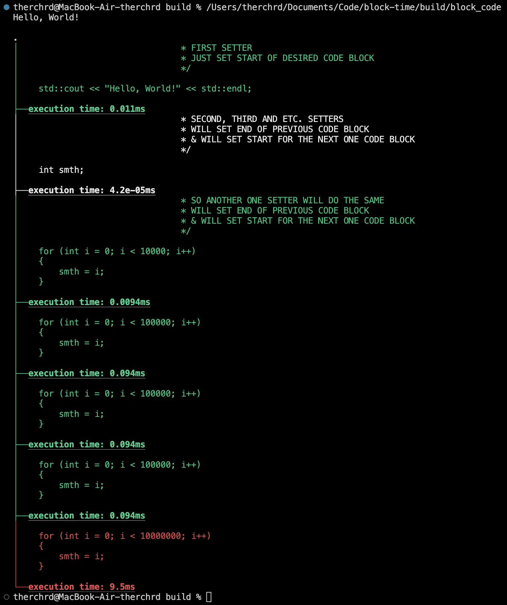

# Block — Time

---

## OVERVIEW

This repository contains a header file to measure the execution time of specific code blocks. It helps you analyze performance and find the most efficient solutions for your code.

---

## INSTALLATION

To use this library, simply include the header file `block_time.hpp` into your project. You can manually place the header in your project directory or include it from the repository.

### CMake Setup

If you are using CMake, add the following to your `CMakeLists.txt` to ensure the header is included:

```cmake
include_directories(path/to/block_time_header_directory)
```

---

### EXAMPLE

Here’s an example of how to use the BlockTime class to measure execution time for different code blocks:
```cpp
#include <iostream>

#include <tr/block_time.hpp> // INCLUDE HEADER FILE

int main()
{
    tr::BlockTime block_time(__FILE__);  // INITIALIZE WITH THE SOURCE FILE NAME (__FILE__)

    block_time.set();  /* 
                        * FIRST SETTER
                        * JUST SET START OF DESIRED CODE BLOCK
                        */

    std::cout << "Hello, World!" << std::endl;

    block_time.set();  /* 
                        * SECOND, THIRD AND ETC. SETTERS
                        * WILL SET END OF PREVIOUS CODE BLOCK
                        * & WILL SET START FOR THE NEXT ONE CODE BLOCK
                        */

    for (int i = 0; i < 1000; i++)
    {
        int smth = i;
    }

    block_time.set();  /* 
                        * SO ANOTHER ONE SETTER WILL DO THE SAME
                        * WILL SET END OF PREVIOUS CODE BLOCK
                        * & WILL SET START FOR THE NEXT ONE CODE BLOCK
                        */

    for (int i = 0; i < 10000; i++)
    {
        int smth = i;
    }

    block_time.set();

    for (int i = 0; i < 100000; i++)
    {
        int smth = i;
    }

    block_time.set();

    for (int i = 0; i < 100000; i++)
    {
        int smth = i;
    }

    block_time.set();

    for (int i = 0; i < 100000; i++)
    {
        int smth = i;
    }

    block_time.set();

    for (int i = 0; i < 1000000; i++)
    {
        int smth = i;
    }

    block_time.set();  /* 
                        * THIS SETTER WILL SET START FOR THE NEXT ONE CODE BLOCK BUT I'M NOT INTRESTED INTO
                        * SO I JUST DON'T SET ANOTHER SETTERS
                        */

    block_time.print(); // PRINT EXECUTION TIMES OF ALL BLOCKS

    block_time.clear(); // CLEAR THE TIMES (IF NEEDED)

    return 0;
}
```

### Output

When you run the code, it will output something like this:


### LICENSE
This project is licensed under the MIT License - see the LICENSE file for details.

### BUGS
If you encounter any bugs or issues, please report them at the GitHub Issues page.

### CREDITS
Made with ❤️ by @the-rchrd...
